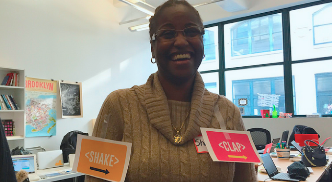

# Mozilla Clubs em encontros na sua comunidade

> Diversifique seu encontro adicionando atividades práticas que seus participantes começam criando e aprendendo a web juntos!

Você se reúnem regularmente/semi-regularmente com um grupo de indivíduos que se reúnem em torno de interesses comuns. Talvez  são adultos ou jovens que se juntam para construir e desenvolver novas habilidades. Com Mozilla Clubs, você pode conectar sua comunidade a uma iniciativa global, utilizando práticas participativas e trazendo a aprendizagem em grupo para os encontros na sua comunidade.

**Mozilla Clubs agregam valores aos seus encontros**:
* Trazendo elementos de leitura, escrita e participação na web em seu contexto e conectando temas que a comunidade se preocupa com o exercício de atividades de aprendizagem prática que ensinam  a ler, escrever e participar da web;
* Proporcionar oportunidades para os participantes criarem, aprenderem e conhecerem um ao outro;
* Fortalecendo sua comunidade através da ligação com uma missão global ao plantar raízes locais para um impacto social positivo.

**Mozilla Clubs motiva os participantes a se encontrarem para**:
* Aprender novas habilidades da web, incluindo ler, escrever e participar da web;
* Capacitar os outros (em sua escola, local de trabalho, comunidade, etc.) para ver a web como uma plataforma global para a criatividade e compartilhamento;
* Ligar sua comunidade a uma missão global.

## Como e por que você deve incorporar Mozilla Clubs em seu encontro

Como líder do encontro ou Capitão de Mozilla Clubs, neste contexto, é possível:
* Usar suas prórpias habilidades de tutoria.
* Criar ou adaptar as atividades que estão centradas nas mesmas coisas que sua comunidade se preocupa.
* Juntar-se a uma rede global e se conectar com outros Capitães de Mozilla Clubs para compartilhar as melhores práticas e contribuir com conteúdo novo/adaptado.

**É fácil começar!** Inicie introduzindo atividades de Mozilla Clubs em seus encontros regulares e e adapte-as aos interesses dos seus grupos. Recomendamos começar com o módulo Alfabetização Web Básica, que é composta por seis atividades, cada uma com aproximadamente 45 minutos de duração.
As atividades fazem grandes quebra-gelos, com o benefício adicional de aprender novas habilidades.
Tente organizar um "Ler, Escrever e Participar da Web" como tema para o seu encontro uma vez ao mês (ou por uma temporada) e seja o facilitador das atividades em cada encontro durante esse período de tempo.
Incentive os participantes a experimentarem as atividades em conjunto e, em seguida, para ensiná-los a outras pessoas antes de seu próximo encontro.

**Você pode fazer isso!**  
 

Estamos aqui para ajudá-lo através do processo de incorporação de um Mozilla clube em seus encontros na comunidade.
* **Materiais:** Temos materiais de treinamento disponíveis on-line em teach.mozilla.org.
* **Suporte individual:** Quando você inicia um Mozilla Club, você será atribuído a um Coordenador Regional para ajudar você a configurar e encontrar os recursos mais relevantes.
* **Apoio em grupo:** Faça perguntas, compartilhe desafios e sucessos de ações, conecte-se com outras pessoas que estão executando programas similares em encontros na comunidade local ou em nosso fórum on-line (Discourse).

* Estudos de caso
	* Comunidade Mozilla local
	* Encontros Hive
	* Grupo de desenvolvedores locais

**Para mais informações:** Visite [teach.mozilla.org/clubs](http://teach.mozilla.org/clubs) ou contate [Lainie DeCoursy](mailto:lainie@mozillafoundation.org).