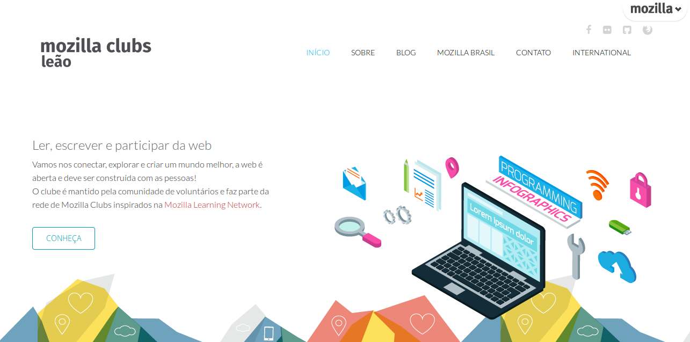

# Creating a website and sharing experiences

> Show the world what your club is doing fantastic and different with a website! Create a blog or static website is easy and can be done with simple management tools.

In this package you will find:

* A guide explaining what domain name, web hosting and CMS.

* A start guide to create websites and blogs in [Wordpress.com] (https://wordpress.com/).

* Remixing a template website in HTML, CSS and JS.

* Tips alternative tools for creating websites, blogs and tell stories.

* Share your website and experiences.

## #1 Understanding how it works a site

#### What is a domain?
Domain is a name that is used to locate and identify your space on the internet. The domain is the basis of all their identification on the Internet. It is the "name" of your website and your emails. It consists of a name and extension, for example:

**leaomozillaclubs.com**
Name: leaomozillaclubs

Extension: ".com"

These names are usually called "domains" (for example: mozilla.org is our domain). 

The domain name was created in order to facilitate the memorization of computer Internet addresses. Without it, we would have to memorize a large number sequence.

#### O que é uma hospedagem de sites?
Hospedagem de site é o serviço de armazenamento de um site e disponibilização constante do mesmo na internet, ou seja, o serviço de hospedagem possibilitará que seu site seja visualizado 24h por dia em todo o mundo.

#### What is a web hosting?
Web hosting is the storage service from a website and constant availability of the same on the Internet, that is, the hosting service will allow your site to be viewed 24 hours a day worldwide.

#### O que é CMS?
Os "Content Management System – Sistema de Gerenciamento de Conteúdo" são, em grande parte, softwares livres, desenvolvido por programadores do mundo inteiro, onde o usuário pode editar e criar conteúdo para seus sites com grande facilidade.

#### What is CMS?
The "Content Management System - Content Management System" are largely free software, developed by programmers around the world, where the user can edit and create content for their websites with great ease.

## #2 Criando um site e blog no Wordpress.com

#### O que é [Wordpress.com](https://wordpress.com/)?

WordPress é a mais popular  plataforma de publicação online. É open source, e utilizada por mais de 20% da Web. O Wordpress.com é um serviço online, uma versão hospedada do software open source. Você pode começar um blog ou site em segundos, sem precisar de conhecimentos técnicos.

**Quase tudo no WordPress.com é grátis.**

#### Acessando, registrando-se e criando o seu primeiro site blog.

Agora que você sabe o que é Wordpress.com, vamos dar os primeiros passos criando uma conta e um novo blog na plataforma.

1. **Acesse Wordpress.com** e clique no botão ["Create Website"](https://wordpress.com/start/themes/en).

2. **Tema**Agora para iniciar efetivamente você precisa escolher um tema bem bonito para seu site! Faça a escolha e dê um clique no seu tema preferido, o Wordpress.com tem muitos temas para você escolher, fique a vontade.
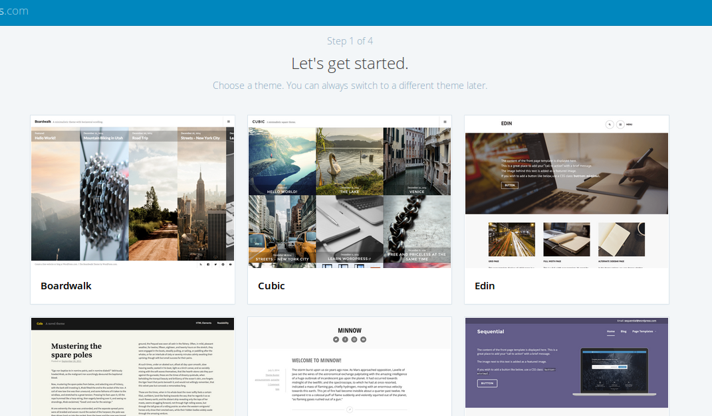

3. **É hora de escolher o domínio**, que é o endereço do seu site na web. É por meio dele que as pessoas vão saber o caminho para chegar até seu novo site, certifique-se de criar um domínio bem legal. O Wordpress.com oferece o subdomínio [seu clube].wordpress.com gratuitamente, mas se você quiser um domínio [.com] você pode com alguns dólares ter um domínio curto.

4. **Escolha um plano.** Saiba que o plano gratuito é ideal para sites novos e possuí muitos recursos para você criar um site fantástico, ele é suficiente para suprir as necessidades de um clube.
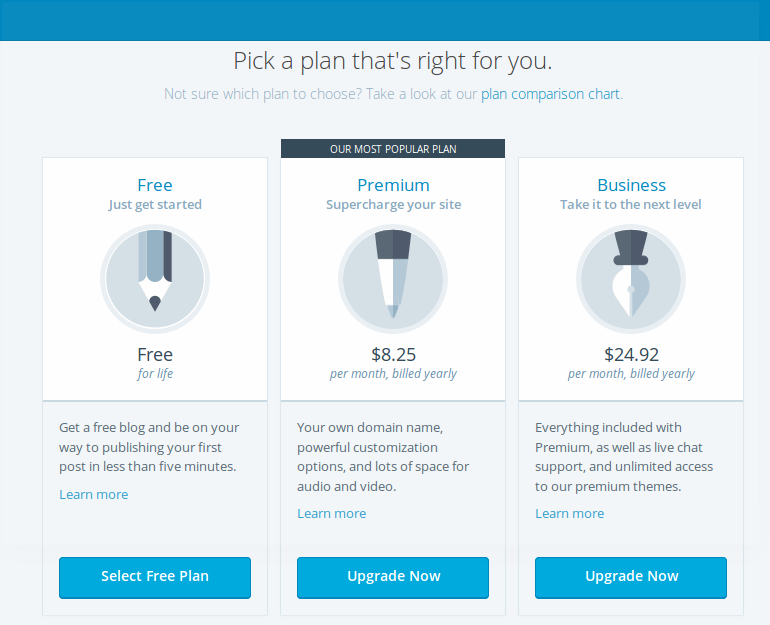

5. **Agora é hora de se identificar.** Digite seu email, usuário e uma senha forte. Clique em "Create my Account" e aguarde o Wordpress.com preparar seu novo site!  

6. **Pronto!** Agora você pode festejar, seu clube agora já tem um novo site! Veja os próximos tópicos para aprender a postar e fazer coisas legais.  
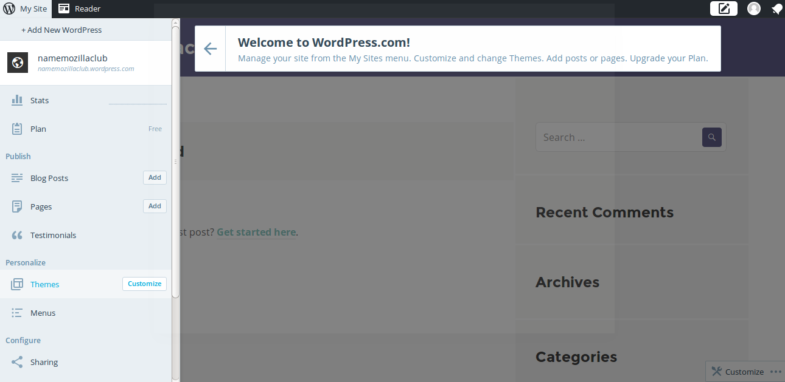

#### Usando o painel de administração e configurando.

**Antes de iniciar!** O Wordpress.com lhe enviou um email para confirmar seu endereço de email, certifique-se de abrir o email e clicar no link de confirmação. Feito isso, está pronto, pode continuar!

1. **Painel de administração.** Vamos começar configurando! No menu lateral você tem acesso a várias opções, clique em "Settings".
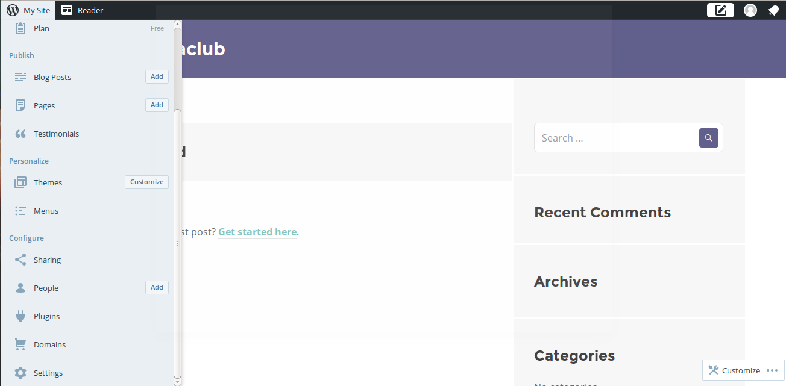

2. **Configuração.** Em "General" você tem acesso as configurações mais simples como nome do site, descrição e idioma. Existem outras configurações mais detalhadas, fique a vontade para customizar e deixar do seu jeito. Após fazer alterações clique em "Save Settings".
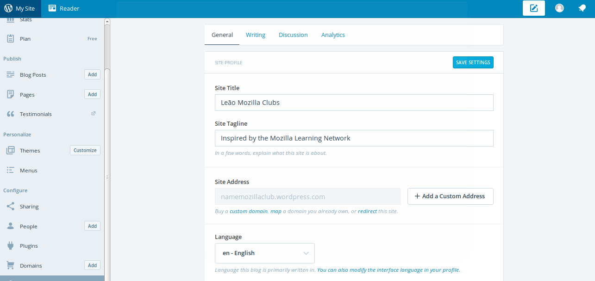

#### Postando artigos.

1. **Posts.** Aqui você pode começar a criar posts! Em "Blog Posts" no botão "Add" você pode começar a contar suas histórias.
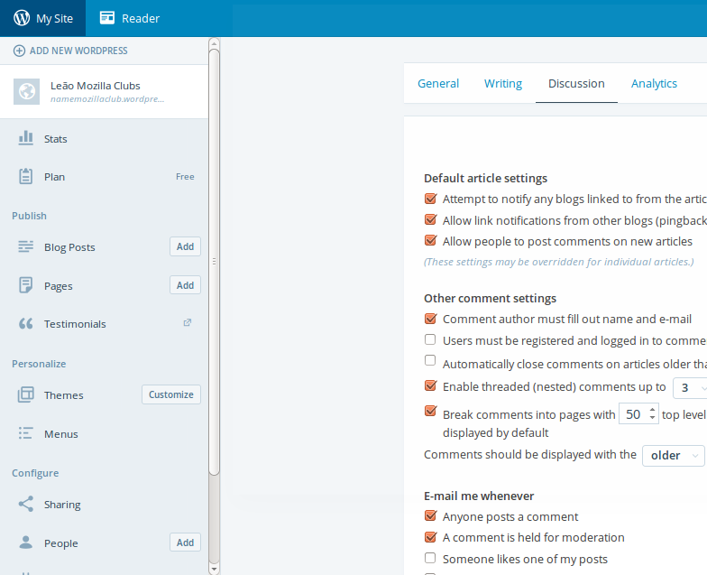

2. **Escrevendo.** Perceba que a ferramenta é de fácil compreensão, no topo você escreve o título, no corpo do texto você tem uma série de opções para marcar o seu texto deixando em Bold e Itálico, criando listas, sequências numéricas, citações, imagens, entre outros recursos para usar a vontade e deixar seu texto bem legal.
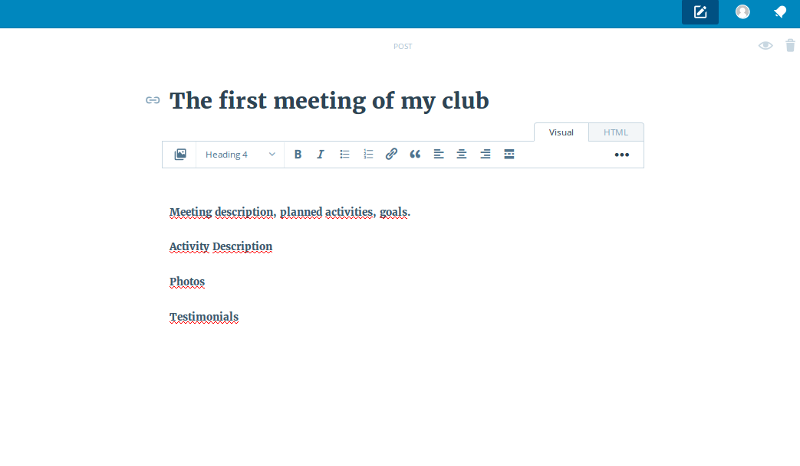

3. **Categorias.** As categorias são criadas para organizar seus posts em temas e seções específicas, e você pode criar novas categorias clicando em "Add a new category", escreva o nome na boxlight que abriu e depois clique em "Add".  
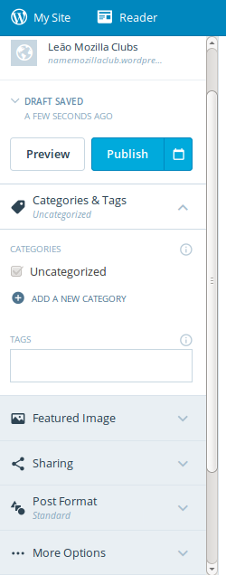

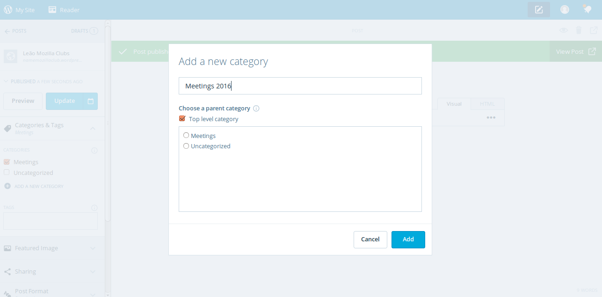

#### Outras ferramentas para explorar e descobrir.
Existem muitas ferramentas para explorar e aprender no Wordpress.com, eu recomendo que você navegue pelo menu do painel de administração e assim vai descobrir novas maneiras de personalizar, criar páginas, mudar o tema, entre outros. Eu separei algumas seções para você conhecer primeiro, explorar e aprender na prática.

1. **Temas.** Você pode alterar o tema a qualquer momento.
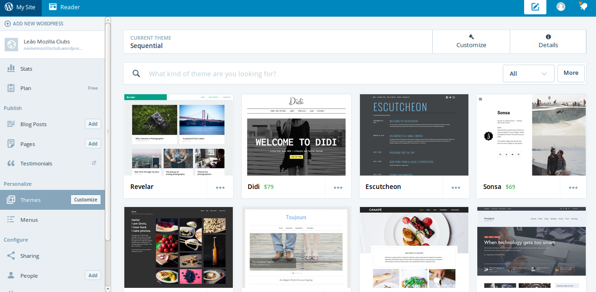

2. **Novas paginas.** Crie novas paginas estáticas.
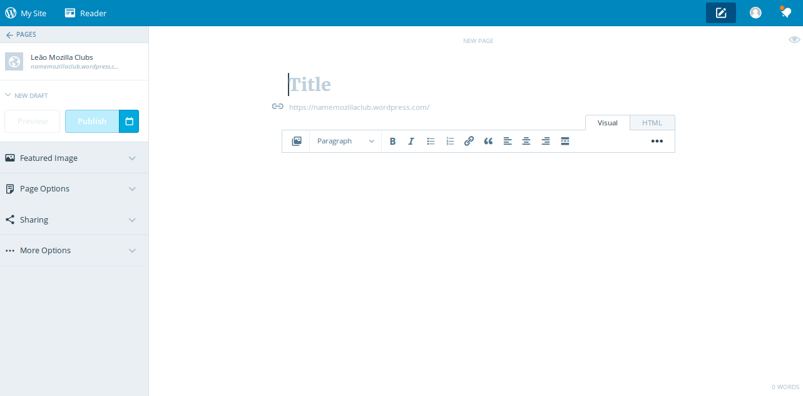

3. **Organize o menu.** Você pode organizar o menu da maneira que quiser.

#### Versão final.
Após a configuração, primeira postagem, organização de menu e criação de novas paginas, você já pode começar a divulgar o endereço do seu site nas redes sociais, para os amigos e membros do clube.

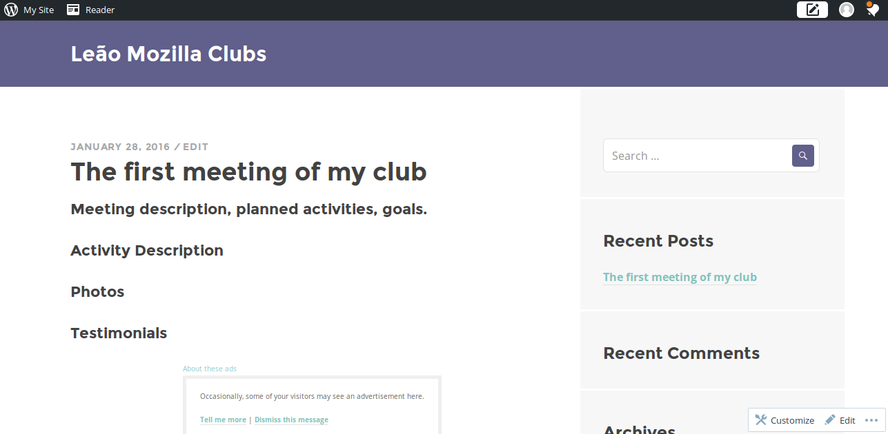

## #3 Remixando um site modelo em HTML, CSS e JS

Se você tem super poderes digitais e já desenvolve com HTML, CSS e Javascript você pode remixar o código do fantástico layout criado pelo [Leão Mozilla Clubs](https://leaomozillaclubs.com/).

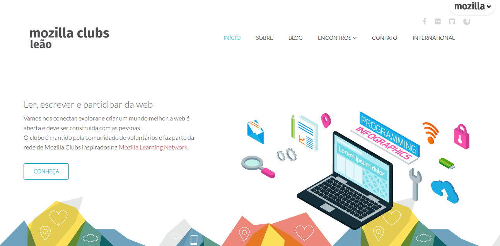

O layout criado pelo [Leão Mozilla Clubs](https://leaomozillaclubs.com/) é fácil de modificar e você pode apenas adicionar seu conteúdo e suas imagens!

1. **Download.** Fazendo download e descompactando o arquivo.
Faça download do layout pelo [GitHub](https://github.com/LeaoMozillaClubs/leaomozillaclubs.github.io/archive/master.zip/) e descompacte o arquivo.
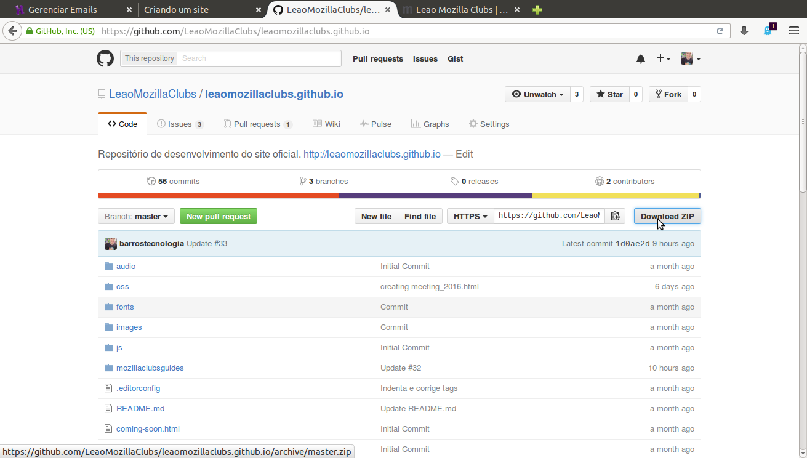

2. **Pastas e arquivos.** Abra a pasta descompactada e veja os arquivos e pastas que você encontra. Fique atento para os caminhos e arquivos de onde você deve alterar:

**index.html** => Aqui é onde você vai editar a pagina inicial.

**/images/home** => Aqui estão as imagens da pagina inicial, você pode adicionar mais imagens a vontade e excluir as existentes.

3. **Edite HTML.** A pagina onde fica o conteúdo é a inicial, dessa forma você deve alterar o **index.html**, no [Sublime Text](https://www.sublimetext.com/) é fácil editar esse arquivo, todos os textos destacados em **branco** são dos textos existentes na pagina inicial, basta alterar. Nos locais onde há imagens coloque o nome dos arquivos das imagens novas. Ficou fácil?
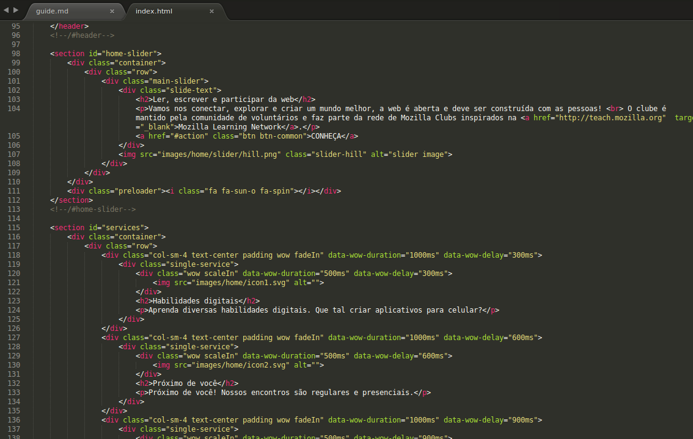

3. **Publique.** Você pode publicar isso de 2 formas fáceis: por meio do [GitHub Pages](https://pages.github.com/) ou conseguindo uma hospedagem e sub-domínio da infraestrutura web de sua comunidade Mozilla local.

No [GitHub Pages](https://pages.github.com/) é muito fácil, basta criar um repositório com o nome dessa forma "[usuário do GitHub].github.io", faça o upload para o GitHub dos arquivos e pronto, o site está publicado no endereço criado pelo nome do repositório.
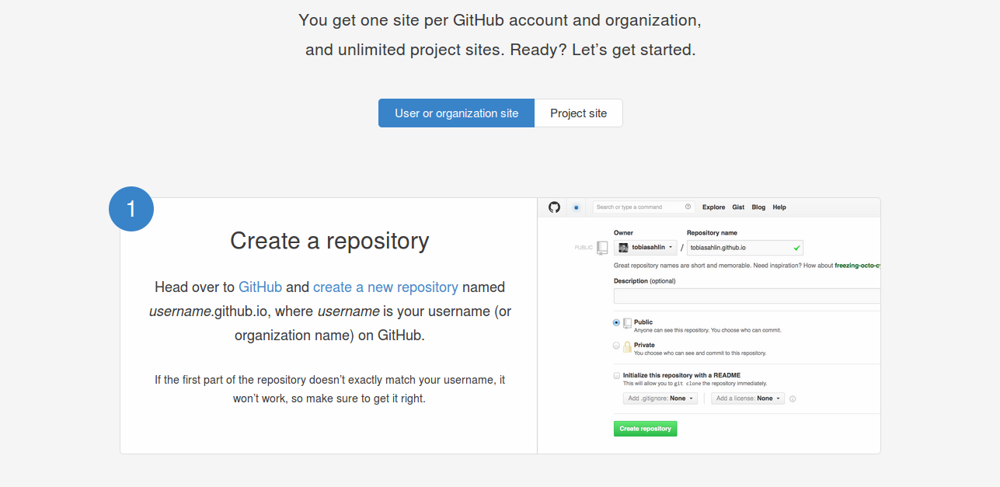

## #4 Dicas de ferramentas alternativas para criar sites, blogs e contar histórias

#### [Mobirise](https://mobirise.com/)
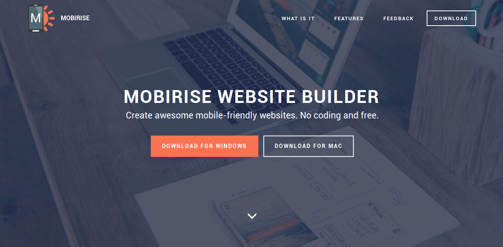

#### [Medium](https://medium.com/)
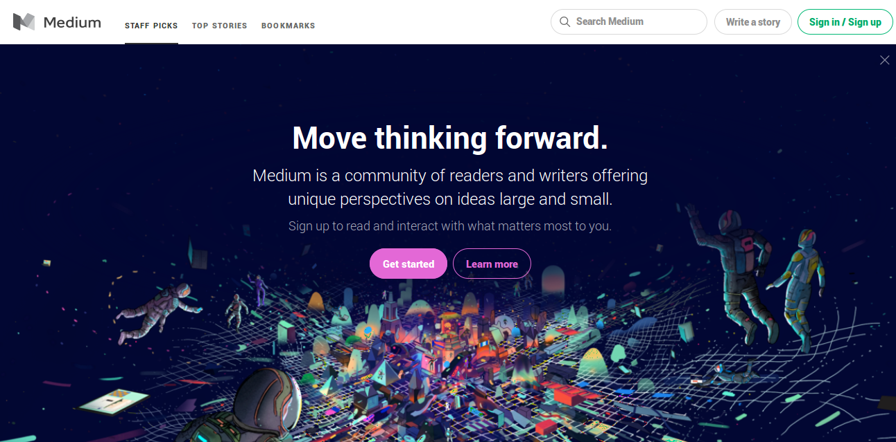

#### [Tumblr](https://www.tumblr.com/)
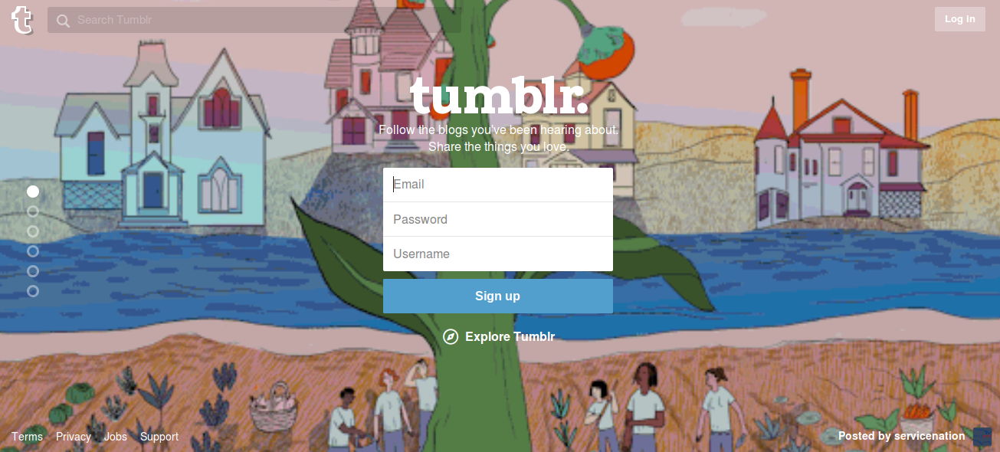

## #5 Compartilhe o seu site e sua experiência.

Publique o endereço do seu novo site e nos conte como foi a experiência em criar um site para seu clube, compartilhe em nosso fórum no [Discourse](https://discourse.webmaker.org/).

Se você tiver alguma dúvida, por favor, envie um e-mail para  [teachtheweb@mozillafoundation.org](mailto:teachtheweb@mozillafoundation.org).
