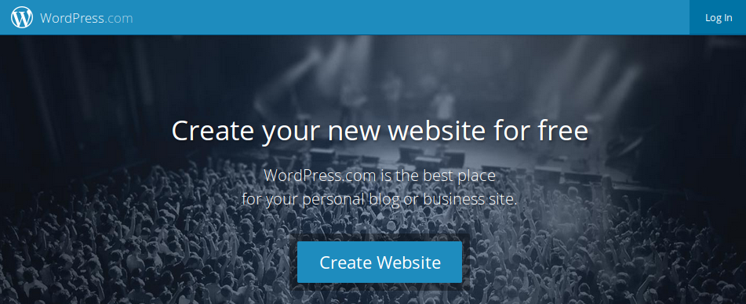
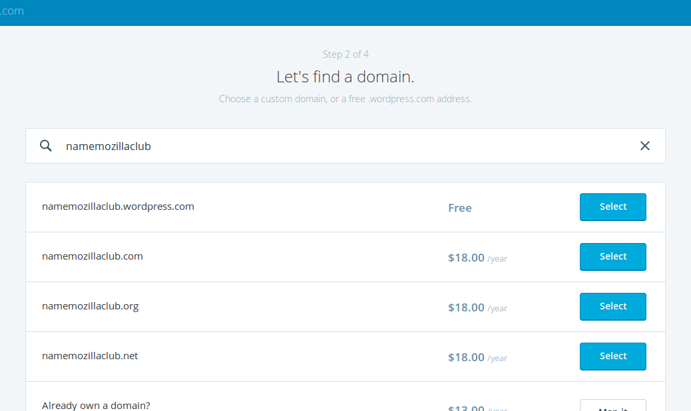
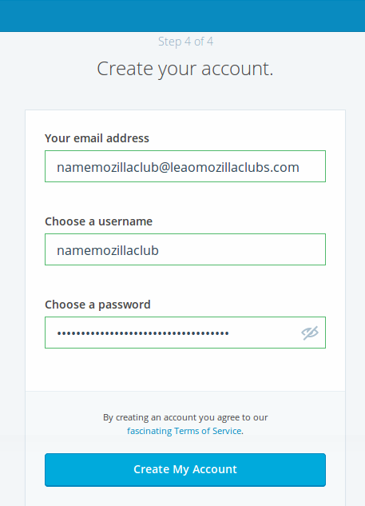
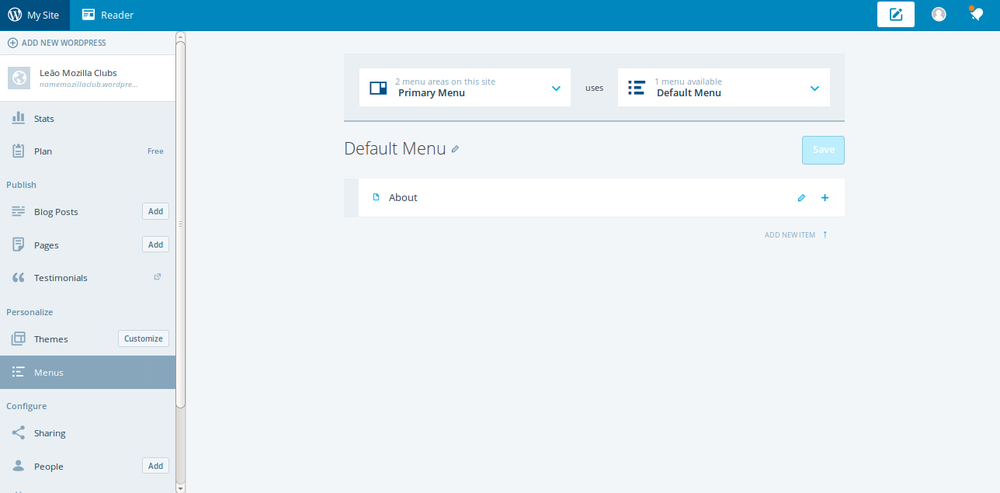

# Creating a website and sharing experiences

> Show the world what your club is doing fantastic and different with a website! Create a blog or static website is easy and can be done with simple management tools.

In this package you will find:

* A guide explaining what domain name, web hosting and CMS.

* A start guide to create websites and blogs in [Wordpress.com] (https://wordpress.com/).

* Remixing a template website in HTML, CSS and JS.

* Tips alternative tools for creating websites, blogs and tell stories.

* Share your website and experiences.

## #1 Understanding how it works a site

#### What is a domain?
Domain is a name that is used to locate and identify your space on the internet. The domain is the basis of all their identification on the Internet. It is the "name" of your website and your emails. It consists of a name and extension, for example:

**leaomozillaclubs.com** 
Name: leaomozillaclubs 
Extension: ".com" 

These names are usually called "domains" (for example: mozilla.org is our domain). 

The domain name was created in order to facilitate the memorization of computer Internet addresses. Without it, we would have to memorize a large number sequence.

#### What is a web hosting?
Web hosting is the storage service from a website and constant availability of the same on the Internet, that is, the hosting service will allow your site to be viewed 24 hours a day worldwide.

#### What is CMS?
The "Content Management System - Content Management System" are largely free software, developed by programmers around the world, where the user can edit and create content for their websites with great ease.

## #2 Creating a website and blog on Wordpress.com

#### What is [Wordpress.com](https://wordpress.com/)?
WordPress is the most popular online publishing platform. It is open source, and used by more than 20% of the Web. Wordpress.com is an online service, a hosted version of open source software. You can start a blog or website in seconds without technical knowledge.

**Almost everything at WordPress.com is free.**

#### Accessing, by registering and creating your first blog site.

Now that you know what is Wordpress.com, let's get started by creating an account and a new blog on the platform.

1. **Visit Wordpress.com** and click the button ["Create Website"](https://wordpress.com/start/themes/en).

2. **Theme** Now to actually start you need to choose a very beautiful theme for your site! Make your choice and click on your preferred theme, Wordpress.com has many themes to choose from, be my guest.

3. **It's time to choose the domain**, what is the address of your web site. It is through him that people will know the way to get to your new site, be sure to create a cool area. The Wordpress.com offers the subdomain [name-club].wordpress.com free, but if you want a domain [.com] you can with a few bucks to have a short domain.

4. **Choose a plan.** Know that the free plan is ideal for new sites and possess many features for you to create a fantastic site, it is sufficient to meet the needs of a club.

5. **Now it's time to identify.** Enter your email, username and a strong password. Click "Create my Account" and wait for the Wordpress.com prepare your new site!  

6. **Ready!** Now you can celebrate his club now has a new website! See the following topics to learn how to post and do cool things.

#### Using the admin panel and setting.

**Before starting!** The Wordpress.com sent you an email to confirm your email address, make sure you open the email and click the confirmation link. That done, you are ready, you can continue!

1. **Admin panel.** Let's start configuring! In the side menu you have access to several options, click "Settings".

2. **Configuration.** "General" you have access to the most simple settings such as site name, description and language. There are other more detailed settings, feel free to customize and make your way. After making changes click "Save Settings".

#### Posting articles.

1. **Posts.** Here you can start creating posts! In "Blog Posts" in the "Add" button you can start to tell their stories.

2. **Writing.** You realize that the tool is easy to understand, at the top you write the title in the text you have a number of options to mark your text leaving Bold and Italic, creating lists, numerical sequences, quotes, images, and other resources to use and will leave your cool text.

3. **Categories.** The categories are created to organize your posts on specific topics and sections, and you can create new categories by clicking on "Add a new category", type the name in lightbox which opened and then click "Add".  

#### Other tools to explore and discover.
There are many tools to explore and learn on Wordpress.com, I recommend that you browse through the administration panel menu and so will discover new ways to customize, create pages, change the theme, among others. I separated some sections for you to know first, explore and learn in practice.

1. **Themes.** You can change the theme at any time.

2. **News pages.** Create new static pages.

3. **Organize menu.** You can organize the way you want menu.

#### Final version.
After setup, first post, menu organization and creating new pages, you can start to disclose the address of your site on social networks for friends and members of the club.

## #3 Mixing a model site in HTML, CSS and JS

If you have digital super powers and is already developing with HTML, CSS and Javascript you can remix the code fantastic layout created by [Leão Mozilla Clubs](https://leaomozillaclubs.com/).

The layout created by [Leão Mozilla Clubs](https://leaomozillaclubs.com/) is easy to modify and you can just add your content and images!

1. **Download.** Downloading and unzipping the file.
Download the layout at [GitHub](https://github.com/LeaoMozillaClubs/leaomozillaclubs.github.io/archive/master.zip/) and unzip the file.

2. **Folders and files.** Open the unzipped folder and view the files and folders that you find. Stay tuned for the paths and files where you must change:

**index.html** => Aqui é onde você vai editar a pagina inicial.

**/images/home** => Aqui estão as imagens da pagina inicial, você pode adicionar mais imagens a vontade e excluir as existentes.

3. **Edite HTML.** A pagina onde fica o conteúdo é a inicial, dessa forma você deve alterar o **index.html**, no [Sublime Text](https://www.sublimetext.com/) é fácil editar esse arquivo, todos os textos destacados em **branco** são dos textos existentes na pagina inicial, basta alterar. Nos locais onde há imagens coloque o nome dos arquivos das imagens novas. Ficou fácil?

3. **Publique.** Você pode publicar isso de 2 formas fáceis: por meio do [GitHub Pages](https://pages.github.com/) ou conseguindo uma hospedagem e sub-domínio da infraestrutura web de sua comunidade Mozilla local.

No [GitHub Pages](https://pages.github.com/) é muito fácil, basta criar um repositório com o nome dessa forma "[usuário do GitHub].github.io", faça o upload para o GitHub dos arquivos e pronto, o site está publicado no endereço criado pelo nome do repositório.

## #4 Dicas de ferramentas alternativas para criar sites, blogs e contar histórias

#### [Mobirise](https://mobirise.com/)

#### [Medium](https://medium.com/)

#### [Tumblr](https://www.tumblr.com/)

## #5 Compartilhe o seu site e sua experiência.

Publique o endereço do seu novo site e nos conte como foi a experiência em criar um site para seu clube, compartilhe em nosso fórum no [Discourse](https://discourse.webmaker.org/).

Se você tiver alguma dúvida, por favor, envie um e-mail para  [teachtheweb@mozillafoundation.org](mailto:teachtheweb@mozillafoundation.org).
