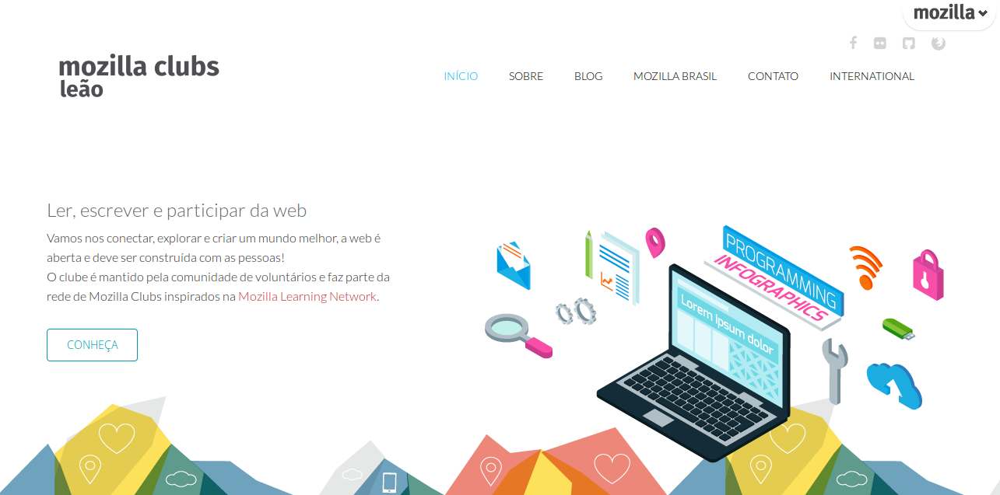

# Criando um site e compartilhando experiências

> Mostre ao mundo o que o seu clube está fazendo de fantástico e diferente com um site! Criar um blog ou site estático é fácil e pode ser feito com ferramentas de simples gerenciamento.

Neste pacote, você encontrará:

* Um guia explicando o que é nome de domínio, hospedagem de sites e CMS.

* Um guia de início para criar sites e blogs no [Wordpress.com](https://wordpress.com/).

* Um guia de início para criar um microblog no [Tumblr](https://www.tumblr.com/).

* Um guia de início para contar histórias no [Medium](https://medium.com/).

* Remixando um site modelo em HTML, CSS e JS.

* Dicas de ferramentas alternativas para criar sites e blog.

* Compartilhe o seu site e sua experiência.

## #1 Entendendo como funciona um site

#### O que é um domínio?
Domínio é um nome que serve para localizar e identificar o seu espaço na internet. O domínio é a base de toda a sua identificação na Internet. É o “nome” do seu site e dos seus e-mails. Ele é composto por um nome e uma extensão, exemplo:

**leaomozillaclubs.com** 
Nome: leaomozillaclubs  
Extensão: .com 

Estes nomes são normalmente chamados de "domínios" (por exemplo: mozilla.org é o nosso domínio). 

O nome de domínio foi criado com o objetivo de facilitar a memorização dos endereços de computadores na Internet. Sem ele, teríamos que memorizar uma sequência grande de números.

#### O que é uma hospedagem de sites?
Hospedagem de site é o serviço de armazenamento de um site e disponibilização constante do mesmo na internet, ou seja, o serviço de hospedagem possibilitará que seu site seja visualizado 24h por dia em todo o mundo.

#### O que é CMS?
Os "Content Management System – Sistema de Gerenciamento de Conteúdo" são, em grande parte, softwares livres, desenvolvido por programadores do mundo inteiro, onde o usuário pode editar e criar conteúdo para seus sites com grande facilidade.

## #2 Criando um site e blog no Wordpress.com

#### O que é [Wordpress.com](https://wordpress.com/)?

WordPress é a mais popular  plataforma de publicação online. É open source, e utilizada por mais de 20% da Web. O Wordpress.com é um serviço online, uma versão hospedada do software open source. Você pode começar um blog ou site em segundos, sem precisar de conhecimentos técnicos.

**Quase tudo no WordPress.com é grátis.**

#### Acessando, registrando-se e criando o seu primeiro site blog.

Agora que você sabe o que é Wordpress.com, vamos dar os primeiros passos criando uma conta e um novo blog na plataforma.

1. **Acesse Wordpress.com** e clique no botão ["Create Website"](https://wordpress.com/start/themes/en).
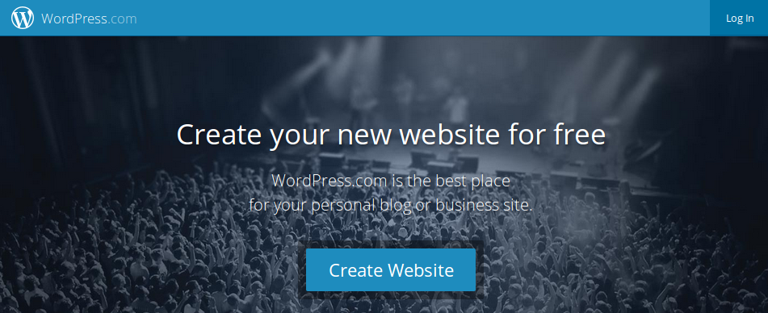

2. **Tema**Agora para iniciar efetivamente você precisa escolher um tema bem bonito para seu site! Faça a escolha e dê um clique no seu tema preferido, o Wordpress.com tem muitos temas para você escolher, fique a vontade.
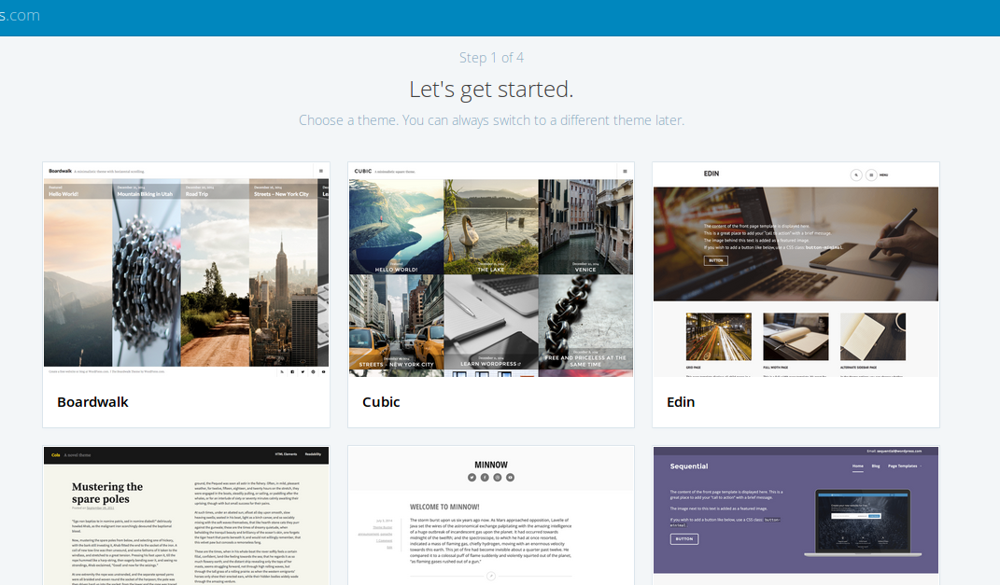

3. **É hora de escolher o domínio**, que é o endereço do seu site na web. É por meio dele que as pessoas vão saber o caminho para chegar até seu novo site, certifique-se de criar um domínio bem legal. O Wordpress.com oferece o subdomínio [seu clube].wordpress.com gratuitamente, mas se você quiser um domínio [.com] você pode com alguns dólares ter um domínio curto.
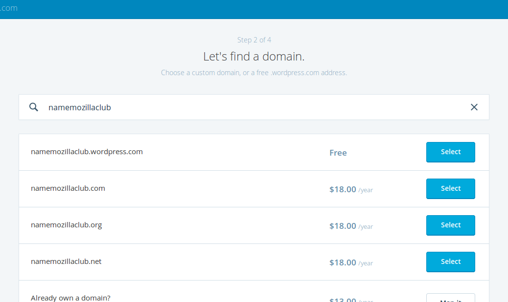

4. **Escolha um plano.** Saiba que o plano gratuito é ideal para sites novos e possuí muitos recursos para você criar um site fantástico, ele é suficiente para suprir as necessidades de um clube.

5. **Agora é hora de se identificar.** Digite seu email, usuário e uma senha forte. Clique em "Create my Account" e aguarde o Wordpress.com preparar seu novo site!  
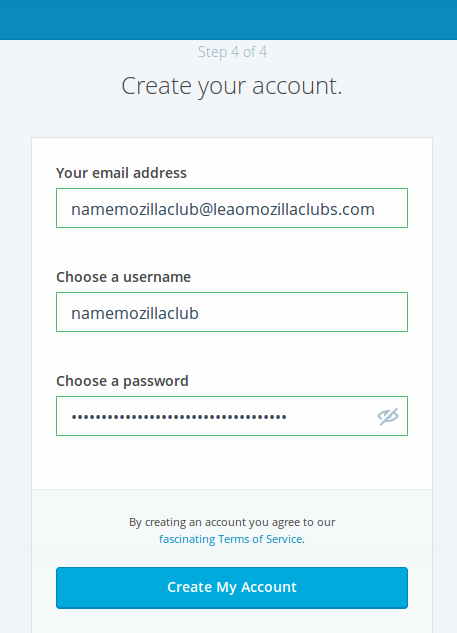

6. **Pronto!** Agora você pode festejar, seu clube agora já tem um novo site! Veja os próximos tópicos para aprender a postar e fazer coisas legais.  
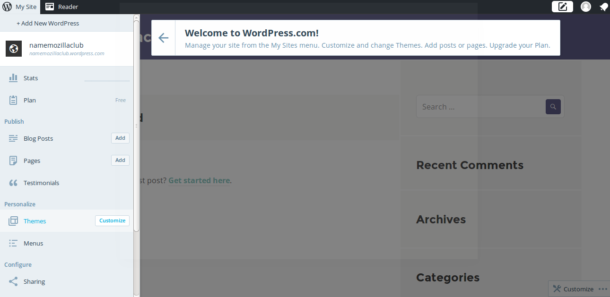

#### Usando o painel de administração e configurando.

**Antes de iniciar!** O Wordpress.com lhe enviou um email para confirmar seu endereço de email, certifique-se de abrir o email e clicar no link de confirmação. Feito isso, está pronto, pode continuar!

1. **Painel de administração.** Vamos começar configurando! No menu lateral você tem acesso a várias opções, clique em "Settings".

2. **Configuração.** Em "General" você tem acesso as configurações mais simples como nome do site, descrição e idioma. Existem outras configurações mais detalhadas, fique a vontade para customizar e deixar do seu jeito. Após fazer alterações clique em "Save Settings".
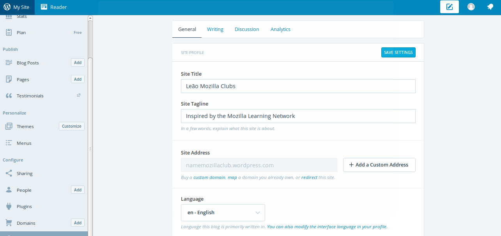

#### Postando artigos.

1. **Posts.** Aqui você pode começar a criar posts! Em "Blog Posts" no botão "Add" você pode começar a contar suas histórias.
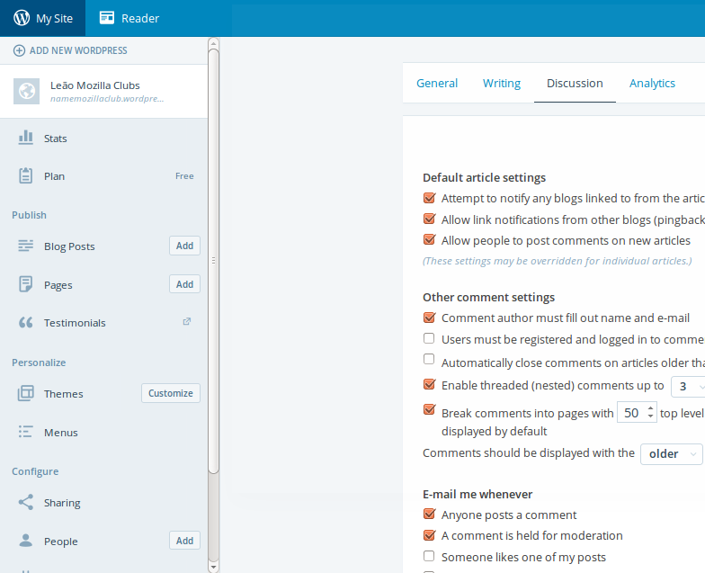

2. **Escrevendo.** Perceba que a ferramenta é de fácil compreensão, no topo você escreve o título, no corpo do texto você tem uma série de opções para marcar o seu texto deixando em Bold e Itálico, criando listas, sequências numéricas, citações, imagens, entre outros recursos para usar a vontade e deixar seu texto bem legal.
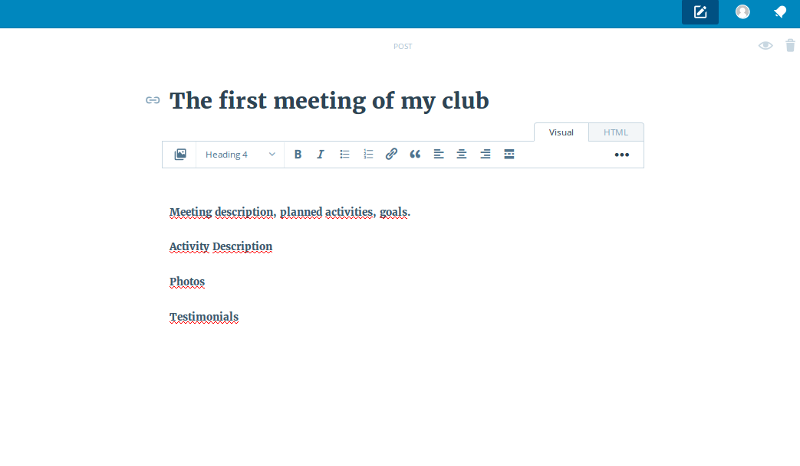

3. **Categorias.** As categorias são criadas para organizar seus posts em temas e seções específicas, e você pode criar novas categorias clicando em "Add a new category", escreva o nome na boxlight que abriu e depois clique em "Add".  

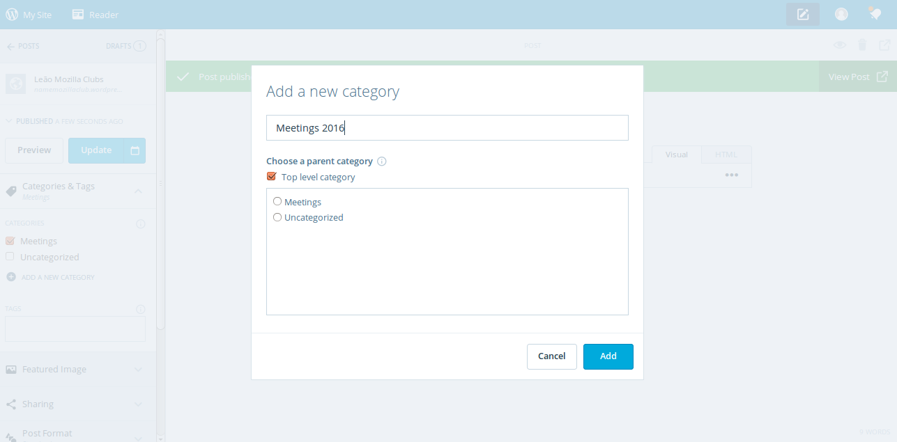

#### Outras ferramentas para explorar e descobrir.
Existem muitas ferramentas para explorar e aprender no Wordpress.com, eu recomendo que você navegue pelo menu do painel de administração e assim vai descobrir novas maneiras de personalizar, criar páginas, mudar o tema, entre outros. Eu separei algumas seções para você conhecer primeiro, explorar e aprender na prática.

1. **Temas.** Você pode alterar o tema a qualquer momento.
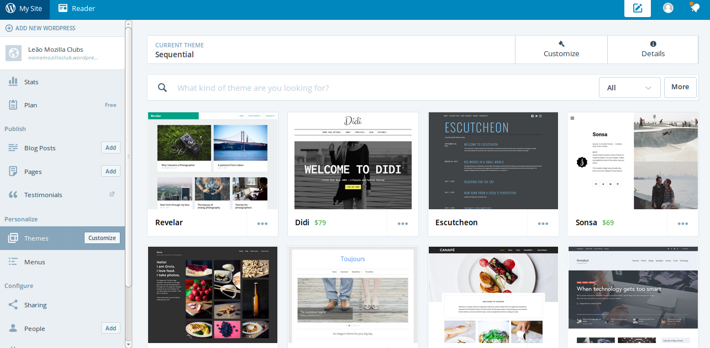

2. **Novas paginas.** Crie novas paginas estáticas.
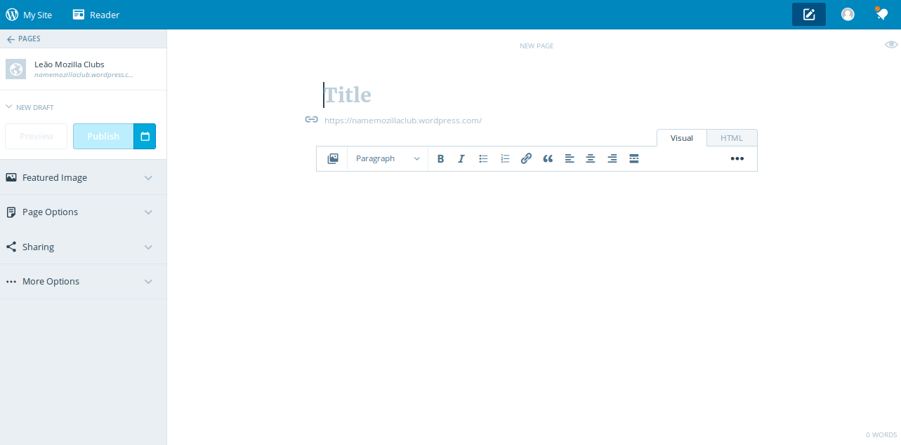

3. **Organize o menu.** Você pode organizar o menu da maneira que quiser.
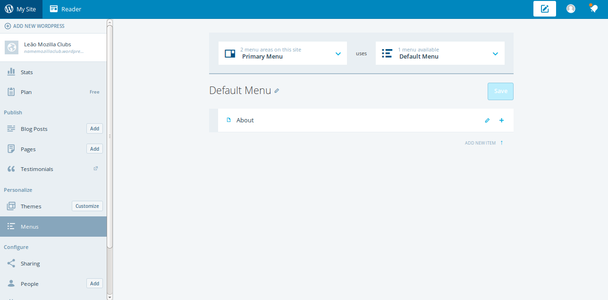

#### Versão final.
Após a configuração, primeira postagem, organização de menu e criação de novas paginas, você já pode começar a divulgar o endereço do seu site nas redes sociais, para os amigos e membros do clube.

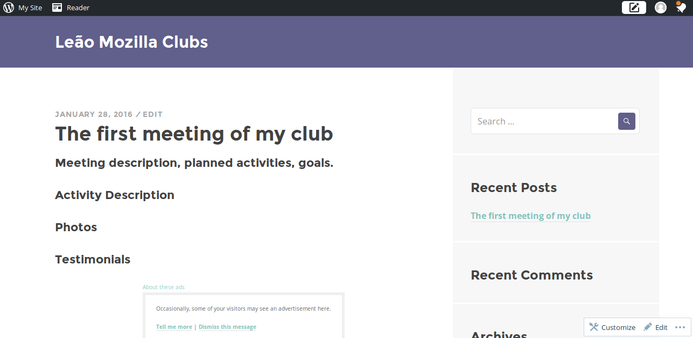

## #3 Criando um microblog no Tumblr

## #4 Contando histórias no Medium

## #5 Remixando um site modelo em HTML, CSS e JS

## #6 Dicas de ferramentas alternativas para criar sites e blog

## #7 Compartilhe o seu site e sua experiência.

Publique o endereço do seu novo site e nos conte como foi a experiência em criar um site para seu clube, compartilhe em nosso fórum no [Discourse](https://discourse.webmaker.org/)

Se você tiver alguma dúvida, por favor, envie um e-mail para [teachtheweb@mozillafoundation.org](mailto:teachtheweb@mozillafoundation.org).