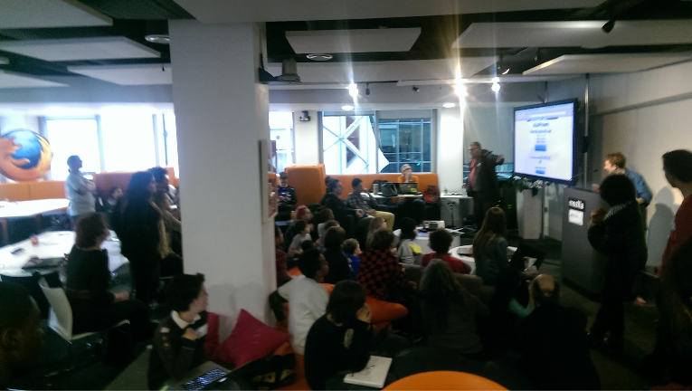

# Mozilla Clubs em programa existente

**Mozilla clubes pode adicionar uma dinâmica educacional para os seus encontros de um programa existente.**

**Você já organiza encontros semanais e mensais em um cenário de clube?** Mozilla Clubs são projetados de modo que eles podem ser usados como complemento à sua estrutura existente sem alterar a natureza do seu grupo. Você pode embutir um clube de alfabetização web em sua programação local, sem perder a identidade de seu clube.

Você já tem um programa funcionando, tais como acampamento de verão, conferência de adolescentes protagonistas ou local de reunião para a comunidade local? Uma reunião de jovens adultos que querem aprender novas habilidades digitais que permitem empregos e oportunidades melhores ou para as pessoas que buscam uma recolocação e estão ansiosas para aprederem novas habilidades e entendercomo a web funciona.

## Por que?
A Mozilla oferece currículo que você pode ensinar regularmente para os participantes do clube que podem adicionar muitos benefícios educacionais para sua programação existente. Mozilla Clubs está oferecendo ferramentas de alfabetização web e recursos que podem ser usados para outras habilidades em leitura, escrita e participação na web.

## Como?
Você já tem programa existente e funcionando, dessa forma já tem uma sala de aula de alunos que se reúnem na biblioteca, centro comunitário local ou ao redor da mesa de uma cozinha. Você tem um grupo estabelecido com o foco em uma meta. Mozilla Clubs pode agregar ao seu programa como um momento especial de descontração e aprendizagem, proporcionando atividades com um objetivo claro e resultados em torno da educação digital. Queremos ajudar os sócios do clube mostrando-lhes como ensinar com as práticas abertas. Mozilla Clubs são formados a nível local, mas ligados a uma comunidade global, você está liderando e aprendendo com uma equipe maior.
Nós encorajamos ativamente a participação do grupo, aprendizagem através do compartilhamento e de atividades práticas.

**Começar é fácil**. Temos currículo definidos e prontos para começar. Capitães de Clube,  como você, têm acesso ao currículo com toda a programação das habilidades e competências necessárias para ler, escrever e participar da web. Construído e testado, o currículo foi criado por professores e entidades educacionais estabelecidas em todo mundo. Há atividades para cada aula, incentivando a participação do grupo e orientação.
Você pode ajustar o currículo para atender às suas próprias necessidades de acordo com suas próprias diretrizes. Temos fóruns onde os educadores podem fazer perguntas ou solicitar ajuda. 

Mozilla Clubs são formados a nível local, mas conectados a uma rede global, você está liderando e aprendendo como uma equipe maior. Há uma grande rede de apoio global de várias pessoas para te ajudar.

* **Materiais:** nós temos materiais, disponíveis online em: [teach.mozilla.org/activities](http://teach.mozilla.org/activities)
* **Suporte individual:**  quando você iniciar um Mozilla Club, você será direcionado a um Coordenador Regional, que tem a responsabilidade de ajudar você a iniciar, buscar recursos relevantes e fornecer suporte. 
* **Apoio em grupo:**  um fórum online [Discourse](http://discourse.webmaker.org/) fornece oportunidades para aprender com outras pessoas ao redor do mundo, usando o currículo do Mozilla Club. Você pode fazer perguntas, compartilhar desafios ou êxitos, ou conectar-se com outros pessoas que incorporaram o projeto em seus programas de pós aula.

### Conheça Sarah que dirige uma CoderDojo e introduziu Mozilla Clubs dentro de seus encontros regulares

Sarah, de Londres organiza um evento MozLdN em seu local de trabalho uma vez por mês, ela mantém aulas de scratch, oficinas HTML e agora inclui Mozilla Clubs no currículo dentro das 3 horas de programação.

> “ Eu estava organizando um encontro local no fim de semana para jovens com idades entre os 10-15 anos de idade e eu já tinha um formato que estava trabalhando para esse dia- 
>O meu clube não só atende a uma ampla gama de idades, mas também uma ampla gama de níveis, assim eu queria incluir um currículo adicional no clube onde algumas crianças que queriam aprender mais e aplicar as habilidades que eles aprenderam através do Scratch ou HTML e agora podem ver essas habilidades aplicadas em outras áreas da web.
>Comecei mergulhando no currículo do site teach.mozilla.org, mas logo percebi através da aplicação do plano curricular e de metas - eu podia ver as habilidades das crianças avançando ao longo das 6 semanas eu ensinei o currículo pré-planejado.
>
>O suporte é excelente, eu nunca me considero altamente técnica ou com grandes habilidades digitais, mas cada lição tinha uma grande estrutura de apoio por trás, onde eu poderia ler a conversa no [Discourse](http://discourse.webmaker.org/), observei o conselho de outros professores que tinham tentado anteriormente, testando a lição com uma variedade de faixas etárias e níveis.
>As lições são dispostas em um formato que é fácil de aplicar no dia a dia sem muitas alterações.
>
>As crianças trabalham comigo sobre o programa de seis semanas, nós aprendemos novas habilidades que podem ser aplicadas em outros lugares dentro da nossa agenda. “

Se você quiser saber mais sobre Mozilla Clubs ou tiver alguma dúvida, por favor fale conosco.

Temos muitas conversas acontecendo no Discourse para que você possa mergulhar e juntar-se a rede para compartilhar suas experiências. Você pode enviar e-mail para [teachtheweb@mozillafoundation.org](mailto:teachtheweb@mozillafoundation.org) se você tiver quaisquer perguntas. 
Ou se você gostaria de falar diretamente com um Coordenador de Mozilla Clubs, por favor contacte directamente a Sarah [sarah@mozillafoundation.org](mailto:sarah@mozillafoundation.org).

