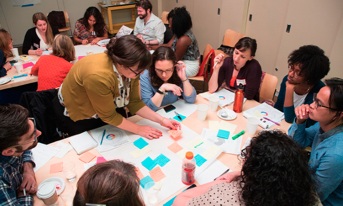
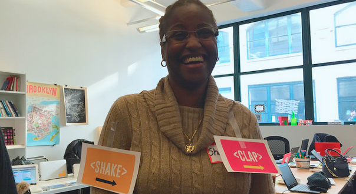

# Mozilla Clubs em bairros com baixa conectividade

> Ajude o próximo bilhão de pessoas ler, escrever e participar na web com atividades práticas adequadas para um ambiente de baixa conectividade!

Você decidiu ajudar sua comunidade ensinando novas habilidades digitais, mas você está em um lugar com baixa conectividade ou nenhuma conexão, ou talvez você tem uma conexão a internet, mas não o suficiente para todos. Você quer ajudar sua comunidade, mas a infraestrutura é um desafio. Este guia irá mostrar-lhe como configurar um clube com atividades adequadas para baixa conectividade e situações totalmente offline. Com Mozilla Clubs, você pode ligar sua comunidade a iniciativa global, utilizando práticas participativas de aprendizagem comunitária. 

**Mozilla Clubs agregam valores a sua comunidade:**
* Promovendo competências digitais que permitem a mudança de vida, oportunidades, como novas carreiras e estudos;
* Ensinar a participar em iniciativas da sociedade civil on-line, tornando assim as necessidades e sonhos de sua região conhecida por um público maior;
* Aprender em comunidade é uma maneira eficaz de fortalecer a sua comunidade e garantir que os participantes possam se conhecer e se familiarizar com toda a comunidade;
* Criando e compartilhando conteúdos que os participantes podem envolver seus próprios contextos (escola, local de trabalho e comunidade);
* Processo participativo e aprendizagem informal pode ser usados ​​para criar e adaptar as atividades que estão centradas sobre as mesmas coisas que a sua comunidade está interessada;
* Seja uma parte de uma iniciativa global,  compartilhando histórias e resultados de sucesso com todo o mundo.

**Mozilla Clubs motiva a comunidade a**:
* Aprender novas habilidades digitais, permitindo melhores empregos e oportunidades;
* Saber como aproveitar a web e seu público para difundir iniciativas sociais e participar de projetos da sociedade civil online;
* Compreender como funciona a internet;
* Conhecer pessoas novas, aprender novas habilidades e descobrir talentos;
* Aprender na prática por meio de métodos informais a partir do compartilhamento de histórias e casos de sucesso, tornando se um multiplicador;
* Fazer parte de uma comunidade global, causando impacto social positivo em sua comunidade;
* Ajudar a espalhar o conhecimento sobre como construir uma rede global focado no ensino de habilidades digitais;
* Capacitar pessoas a expor suas ideias, projetos, histórias e pensamentos na web.

###Como e porquê você deve começar um Mozilla Clubs no seu bairro

Como um Capitão de Mozilla Clubs, neste contexto, você pode:
* Ensinar com seu próprio nível de conhecimento e liderança;
* Criar ou adaptar as atividades alinhadas com as mesmas coisas que sua comunidade está interessada;
* Ser um catalisador em sua região;
* Juntar-se a uma rede global e se conectar com outros     Capitães de Mozilla Clubs para compartilhar as melhores práticas e contribuir com conteúdo novo e/ou adaptado.

**É fácil começar!** Comece o Mozilla Clubs com um grupo inicial de pessoas, experimente iniciar com as atividades básicas já disponíveis em http://teach.mozilla.org. Recomendamos começar com o módulo Alfabetização Web Básica, que é composta por seis atividades, cada um cerca de 45 minutos de duração.
* As atividades fazem grandes quebra-gelos, com o benefício adicional de aprender novas habilidades;
* Ajuda a abrir a porta a novas oportunidades de vida para você e seus participantes com atividades voltadas à qualificação profissional e networking;
* Incentive os participantes a experimentar as atividades em conjunto para ensinar os demais.

    
**You can do it!** 
 

Nós estamos aqui para ajudá-lo a começar um Mozilla Club em sua comunidade. 
* **Materiais:** materiais de ensino disponíveis online em teach.mozilla.org;
* **Atividades para baixa ou nula conectividade:** Oferecemos atividades adequadas para sua situação. Incluem adaptações no currículo atual e atividades especiais desenvolvidas específico para esse tipo de cenário;
* **Suporte individual:** Quando você inicia uma Mozilla Clubs, você vai ser atribuído a um Coordenador Regional para ajudar você a iniciar e dar suporte sempre que necessário;
* **Apoio do time:** Faça perguntas, desafios,  ações de sucesso ou se conecte com outras pessoas que estão executando programas semelhantes na sua comunidade.

São estudos de caso...
* Associação de bairro
* Local compartilhado de grupos de interesse
* Escolas rurais
* Projetos sociais de comunidades carentes
* Capacitação de pessoas para se preparar e encontrar novas carreiras

**Para mais informações:** Visite [teach.mozilla.org/clubs](http://teach.mozilla.org/clubs).